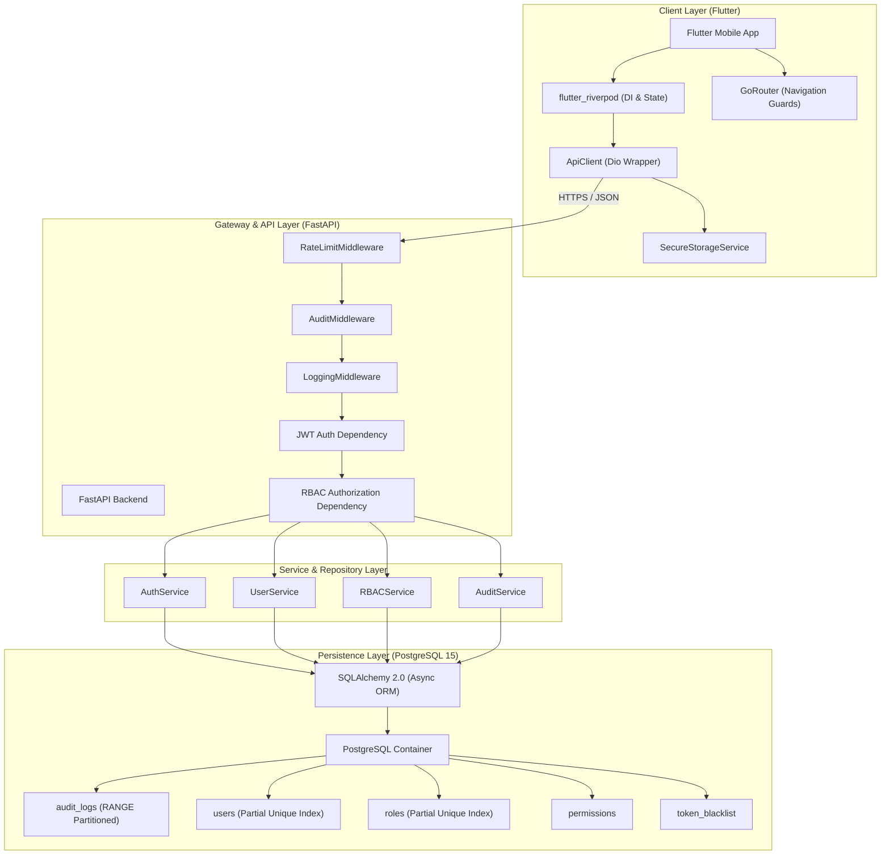
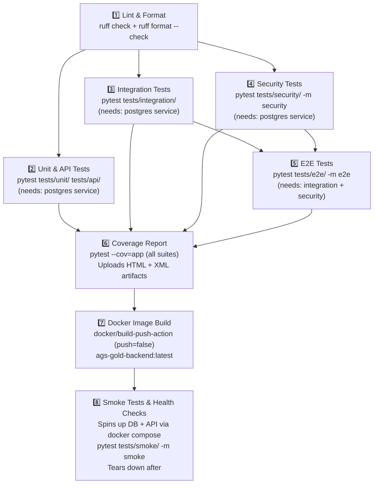
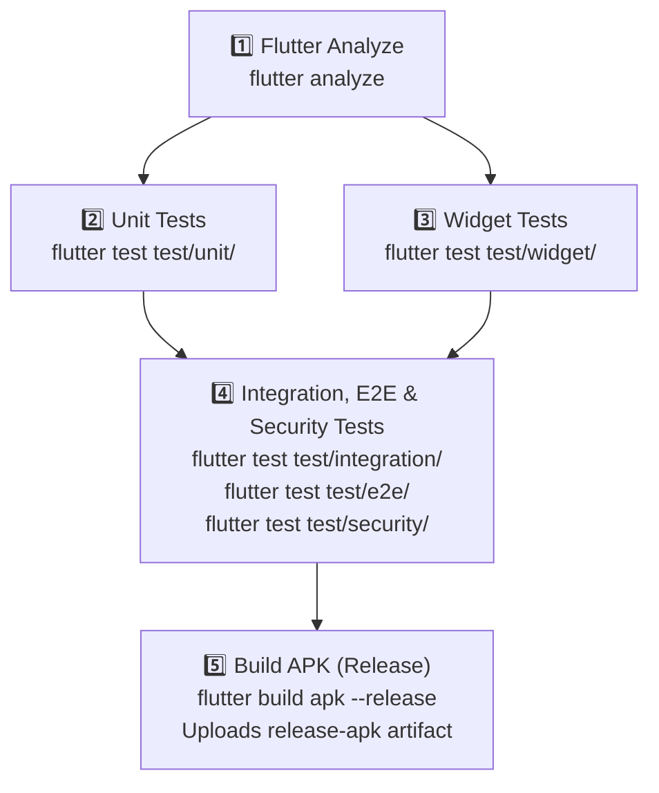

# AGS Gold Enterprise Platform

AGS Gold is an enterprise-grade platform built on a decoupled, high-performance architecture comprising a FastAPI backend, a PostgreSQL relational database, and a cross-platform Flutter mobile client. The platform incorporates Role-Based Access Control (RBAC), JWT Authentication, token blacklisting, rate limiting, automated audit logging, database partitioning, and automated CI/CD pipelines via GitHub Actions.

---

## Current Status

### ✅ Done
- **Project scaffolding** — repository structure, Docker Compose (DB + API services), environment configuration, and `.env.example` in place.
- **Backend API** — FastAPI app with JWT authentication, token blacklisting, RBAC authorization engine, rate limiting middleware, request/audit logging middleware, and health check endpoint.
- **Database layer** — SQLAlchemy 2.0 async models (`User`, `Role`, `Permission`, `AuditLog`, `TokenBlacklist`), 4 Alembic migrations applied, PostgreSQL range partitioning on audit logs, and idempotent seed scripts.
- **Repository & Service layers** — Full repository pattern (`user`, `role`, `permission`, `audit_log`, `token_blacklist`) and service layer (`auth`, `user`, `rbac`, `audit`) with Pydantic v2 schemas.
- **Flutter client** — GoRouter navigation (splash → login → dashboard → profile → admin), Riverpod state management, Material 3 theme, Dio-based `ApiClient` with error-mapped interceptors, and `SecureStorageService`.
- **CI/CD pipelines** — Full multi-stage GitHub Actions pipelines for both backend and Flutter (see [CI/CD Pipeline](#cicd-pipeline) section).
- **Testing infrastructure** — Pytest suites (unit, API, integration, security, e2e, smoke) with coverage reporting; Flutter test dirs (unit, widget, integration, e2e, security) with mocktail + http_mock_adapter.
- **Coding standards** — Ruff linting/formatting enforced on Python; `flutter analyze` enforced on Dart; `.coveragerc` configured.

### 🚧 In Progress
- Flutter screen implementations (admin, profile, dashboard domain logic).
- Business module endpoints (inventory, transactions, reports).
- Audit trail UI integration.

---

## Architecture Diagram



---

## Technology Stack

| Component | Technology | Version | Description |
| :--- | :--- | :--- | :--- |
| **Backend** | Python / FastAPI | `3.12+` / `0.110.0+` | High-performance async API |
| **Auth** | python-jose / passlib | `3.3.0+` / `1.7.4+` | JWT signing and bcrypt hashing |
| **Database** | PostgreSQL / asyncpg | `15+` / `0.29.0+` | Relational storage with range partitioning |
| **ORM & Migrations** | SQLAlchemy / Alembic | `2.0.28+` / `1.13.1+` | Async declarative ORM and schema migrations |
| **Validation** | Pydantic v2 / pydantic-settings | `2.6.0+` / `2.2.0+` | Request/response schemas and env config |
| **Logging** | structlog | `24.1.0+` | Structured JSON logging |
| **Mobile Client** | Flutter / Dart | stable channel / `3.12.1+` | Cross-platform Material 3 client |
| **State & DI** | flutter_riverpod | `3.3.1+` | Reactive state management |
| **Navigation** | go_router | `17.3.0+` | Declarative routing with guards |
| **HTTP Client** | Dio | `5.9.2+` | HTTP client with interceptors |
| **Secure Storage** | flutter_secure_storage | `10.3.1+` | Encrypted token persistence |
| **Testing (Python)** | pytest / pytest-asyncio / httpx | `8.0.0+` / `0.23.5+` / `0.27.0+` | Async test runner and HTTP testing |
| **Testing (Flutter)** | mocktail / http_mock_adapter | `1.0.4+` / `0.6.1+` | Mock testing utilities |
| **CI/CD & DevOps** | Docker / GitHub Actions | `v25+` / `v4+` | Automated testing and build pipelines |

---

## Repository Structure

```text
.github/
└── workflows/
    ├── backend.yml        # Lint → Unit/Integration/Security/E2E Tests → Coverage → Docker → Smoke
    └── flutter.yml        # Analyze → Unit/Widget/Integration/E2E/Security Tests → Build APK
backend/
├── alembic/
│   └── versions/          # 4 applied migration files
├── app/
│   ├── api/               # Route handlers: auth, user, rbac, audit, health
│   │   ├── auth.py        # Login, logout, refresh token endpoints
│   │   ├── user.py        # User CRUD endpoints
│   │   ├── rbac.py        # Role & permission management endpoints
│   │   ├── audit.py       # Audit log query endpoints
│   │   ├── health.py      # Health check endpoint
│   │   └── dependencies.py# JWT & RBAC FastAPI dependencies
│   ├── core/              # App configuration and cross-cutting concerns
│   │   ├── config.py      # Pydantic Settings (env-based configuration)
│   │   ├── security.py    # JWT encode/decode, password hashing
│   │   ├── authorization.py# RBAC permission checks
│   │   ├── exceptions.py  # Custom HTTP exception handlers
│   │   └── logging.py     # structlog configuration
│   ├── database/          # DB engine, session factory, seed scripts
│   │   ├── session.py     # Async engine & session maker
│   │   ├── base.py        # SQLAlchemy declarative base
│   │   └── seed.py        # Idempotent seed (roles, permissions, superadmin)
│   ├── middleware/        # Request lifecycle middlewares
│   │   ├── logging_middleware.py   # Structured request/response logging
│   │   ├── audit_middleware.py     # Automatic mutation audit trail
│   │   └── rate_limit_middleware.py# IP-based rate limiting
│   ├── models/            # SQLAlchemy ORM models
│   │   ├── user.py        # User model (soft delete, partial unique index)
│   │   ├── role.py        # Role model (partial unique index)
│   │   ├── permission.py  # Permission model
│   │   ├── audit_log.py   # AuditLog model (range partitioned)
│   │   ├── token_blacklist.py # Token blacklist model
│   │   ├── associations.py# Role↔Permission many-to-many table
│   │   └── base.py        # UUID PK, timestamp, soft-delete mixins
│   ├── repositories/      # Data access layer (repository pattern)
│   │   ├── user.py        # UserRepository
│   │   ├── role.py        # RoleRepository
│   │   ├── permission.py  # PermissionRepository
│   │   ├── audit_log.py   # AuditLogRepository
│   │   ├── token_blacklist.py # TokenBlacklistRepository
│   │   └── base.py        # Generic async CRUD base repository
│   ├── schemas/           # Pydantic v2 request/response schemas
│   │   ├── auth.py        # Login, token response schemas
│   │   ├── user.py        # User create/update/response schemas
│   │   ├── rbac.py        # Role/permission schemas
│   │   ├── audit_log.py   # Audit log response schemas
│   │   └── base.py        # Shared base schema
│   ├── services/          # Business logic layer
│   │   ├── auth.py        # AuthService (login, logout, token refresh)
│   │   ├── user.py        # UserService (CRUD, role assignment)
│   │   ├── rbac.py        # RBACService (role/permission management)
│   │   ├── audit.py       # AuditService (log querying)
│   │   └── base.py        # Base service
│   └── main.py            # FastAPI app bootstrap, middleware registration
├── tests/
│   ├── conftest.py        # Shared fixtures (async DB, test client, seed data)
│   ├── unit/              # Pure unit tests (services, utilities)
│   ├── api/               # API handler tests (httpx TestClient)
│   ├── integration/       # Cross-layer integration tests
│   ├── security/          # Auth and RBAC security tests
│   ├── e2e/               # Full flow end-to-end tests
│   └── smoke/             # Live API smoke tests (runs against real containers)
├── .coveragerc            # Coverage configuration
├── pytest.ini             # Pytest markers and settings
├── alembic.ini            # Alembic configuration
├── Dockerfile             # Multistage production Docker build
├── docker-compose.yml     # PostgreSQL (port 5435) + API (port 8000) containers
└── requirements.txt       # Python package dependencies
frontend/
├── lib/
│   ├── config/            # Dev/Prod environment configuration
│   ├── core/              # Material 3 themes and responsive layout helpers
│   ├── features/          # Feature modules (screen + domain layer)
│   │   ├── auth/          # Login screen and auth logic
│   │   ├── dashboard/     # Dashboard screen and domain
│   │   ├── profile/       # User profile screen
│   │   ├── admin/         # Admin management screen
│   │   └── splash/        # Splash/session check screen
│   ├── routes/            # GoRouter setup and navigation guards
│   ├── services/          # API client, secure storage, and Riverpod providers
│   │   ├── api_client.dart         # Dio wrapper with interceptors
│   │   ├── secure_storage_service.dart # Encrypted token storage
│   │   └── service_providers.dart  # Riverpod provider definitions
│   └── main.dart          # Flutter app bootstrap
├── test/                  # Test suites: unit, widget, integration, e2e, security
├── analysis_options.yaml  # Dart lint rules
└── pubspec.yaml           # Dart package dependencies
```

---

## Local Development Setup

### Prerequisites

- Python `3.12+`
- Docker Desktop (for PostgreSQL and API containers)
- Flutter SDK `stable` channel
- Java `17+` (for Android APK builds)

### Backend API Setup

1. **Start the PostgreSQL container**:
   ```bash
   cd backend
   docker compose up -d db
   ```

2. **Create and activate a virtual environment**:
   ```bash
   python -m venv .venv
   # Windows PowerShell
   .\.venv\Scripts\Activate.ps1
   # macOS/Linux
   source .venv/bin/activate
   ```

3. **Install dependencies**:
   ```bash
   pip install --upgrade pip
   pip install -r requirements.txt
   ```

4. **Configure environment**:
   Copy `.env.example` to `.env` in `backend/` and fill in values (see [Environment Variables](#environment-variables)).

5. **Run database migrations**:
   ```bash
   # Windows PowerShell
   $env:PYTHONPATH="."
   python -m alembic upgrade head
   ```

6. **Seed initial records** (roles, permissions, superadmin user):
   ```bash
   python app/database/seed.py
   ```

7. **Start the development server**:
   ```bash
   uvicorn app.main:app --reload --port 8000
   ```
   API docs available at: `http://localhost:8000/docs`

### Flutter Mobile App Setup

1. **Install dependencies**:
   ```bash
   cd frontend
   flutter pub get
   ```

2. **Validate code health**:
   ```bash
   flutter analyze
   ```

3. **Run tests**:
   ```bash
   flutter test
   ```

4. **Run the app**:
   ```bash
   # Development environment
   flutter run --dart-define=ENV=dev
   ```

---

## Environment Variables

Copy `backend/.env.example` to `backend/.env`:

```env
# General
ENVIRONMENT=development
PROJECT_NAME="AGS Gold API"

# Security
SECRET_KEY=generate-a-secure-random-token-key-for-prod
ACCESS_TOKEN_EXPIRE_MINUTES=60
SUPERADMIN_PASSWORD=change-me-in-production

# Database (Docker local port is 5435, mapped to internal 5432)
POSTGRES_SERVER=localhost
POSTGRES_PORT=5435
POSTGRES_USER=postgres
POSTGRES_PASSWORD=password123
POSTGRES_DB=ags_gold_db

# CORS (comma-separated)
BACKEND_CORS_ORIGINS=http://localhost:3000,http://localhost:8080
```

---

## Docker Setup

The `docker-compose.yml` in `backend/` defines two services:

| Service | Container | Port |
| :--- | :--- | :--- |
| `db` | `ags-gold-db` (postgres:15-alpine) | `5435 → 5432` |
| `api` | `ags-gold-api` (Dockerfile multistage) | `8000 → 8000` |

```bash
# Start all services
cd backend
docker compose up -d

# Start only the database (for local dev)
docker compose up -d db

# View logs
docker compose logs -f db
docker compose logs -f api

# Tear down
docker compose down -v
```

---

## Database Migrations

4 migrations are applied in sequence:

| Revision | Description |
| :--- | :--- |
| `e906f3e0ff0c` | Create initial schema (users, roles, permissions, audit_logs) |
| `7ffa80359775` | Fix audit_logs columns |
| `a123bc456def` | Create token_blacklist table |
| `e6164fefc93b` | Apply audit fixes |

```bash
# Set PYTHONPATH (Windows PowerShell)
$env:PYTHONPATH="."

# Apply all migrations
python -m alembic upgrade head

# Generate a new migration after model changes
python -m alembic revision --autogenerate -m "describe_changes"

# Rollback one migration
python -m alembic downgrade -1
```

---

## Git Workflow & Branch Strategy

We follow a strict Git Flow model. No direct pushes to `main` or `develop`.

| Branch | Purpose |
| :--- | :--- |
| `main` | Production-only. Fully tested, tagged releases. |
| `develop` | Integration branch. Feature branches merge here. |
| `feature/*` | Individual feature work, branched from `develop`. |
| `bugfix/*` | Hotfixes targeting specific integration issues. |

### Pull Request Requirements
- All GitHub Actions CI checks must pass.
- Minimum 1 peer-review approval.
- Merge via **Squash and Merge** only.

---

## CI/CD Pipeline

Both workflows are **path-filtered** — they only trigger on changes to their respective directories.

### Backend Workflow ([`backend.yml`](.github/workflows/backend.yml))

Triggers on push/PR to `main`, `develop`, `dev` when `backend/**` or the workflow file changes.



### Flutter Workflow ([`flutter.yml`](.github/workflows/flutter.yml))

Triggers on push/PR to `main`, `develop`, `dev` when `frontend/**` or the workflow file changes.



---

## Coding Standards

- **Python**: Enforced via `ruff`. Run before committing:
  ```bash
  ruff check backend/
  ruff format backend/
  ```
- **Flutter**: Enforced via `flutter analyze`. Zero lints, warnings, or deprecations.
- **Coverage**: Tracked via `pytest-cov` with `.coveragerc`. HTML and XML reports uploaded as GitHub Actions artifacts on every pipeline run.

---

## Deployment

### Backend (Docker)

The `Dockerfile` uses a multistage build:
- **Stage 1 (builder)**: Installs all dependencies into a virtual environment.
- **Stage 2 (runtime)**: Copies only the `.venv` to a clean `python:3.12-slim` base, keeping the image footprint minimal.

The full stack (DB + API) can be launched with:
```bash
cd backend
docker compose up -d
```

### Flutter (Android APK)

```bash
cd frontend
flutter build apk --release
# Output: frontend/build/app/outputs/flutter-apk/app-release.apk
```

The CI pipeline uploads `app-release.apk` as a GitHub Actions artifact (`release-apk`) on every successful merge.
